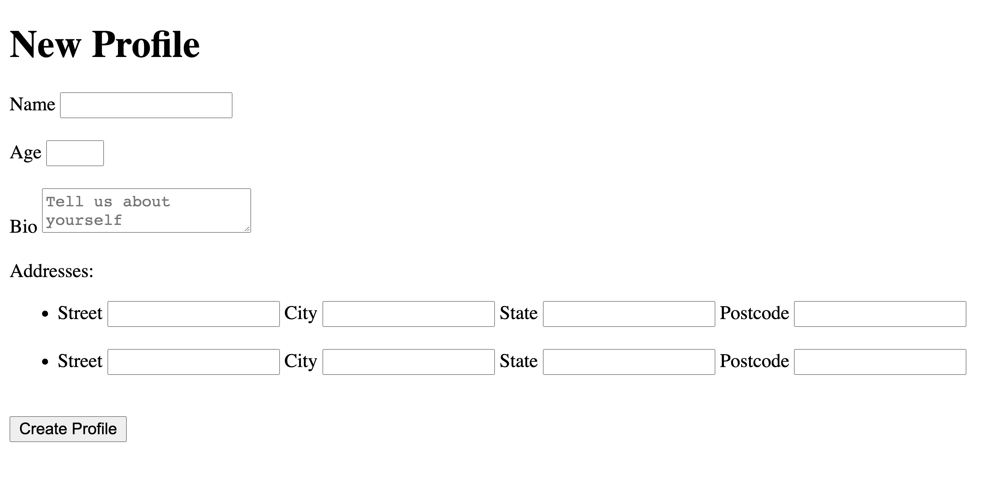

# Rails Profile Form Challenge
## Setup
* Make a fork of this repo
* Clone your fork to your local development environment
* Install dependencies `bundle install`
* Check node dependencies `yarn install --check-files`
* `rails db:create`
* `rails db:migrate`
* Run `rails s` and check that everything is working (you should see welcome to rails!)

## Starter Template
This starter template has model and controller and database set up for profile and address.View folder contains index, edit, new and show html pages

## Challenge

For this challenge, you will need to create a form to capture profile and address data. The data you need to capture can be seen in the database fields in the schema file `db/schema.rb`.

You will also be exploring nested form to allow users to enter multiple address fields.

Check out the docs and read more about nested forms
https://guides.rubyonrails.org/form_helpers.html#nested-forms

This is how the final form should look. It should take in all the data for a profile as well as two addresses. When the user submits the form, it should take them to the profile show page, displaying the name from the profile and the street from each address associated with that profile. 

## Advance Challenge : Optional

**Make sure you have submitted before attempting this step.**

Once you have completed the main part of this challenge and submitted, you can add functionality to edit and delete addresses from the form nested in the profile form.

## Tests and Submitting

At any time you can run `bin/rspec` to see your progress, it will run the automated tests against your code and let you know what your progress is so far. Once you have all the tests passing, you can submit your challenge. To do this make sure you have committed your work:

From the project root `git add .` and add all the files changed in this folder
Commit these files to your repository `git commit -m "challenge completed"`
Make sure your working tree is clear `git status`
Push these files to your github repository `git push origin master`
Log on to Github and visit your fork of this challenge.
Make a pull request to the main branch.
Wait and watch the final tests run, if you are successful it will automatically let your educators know you are finished.